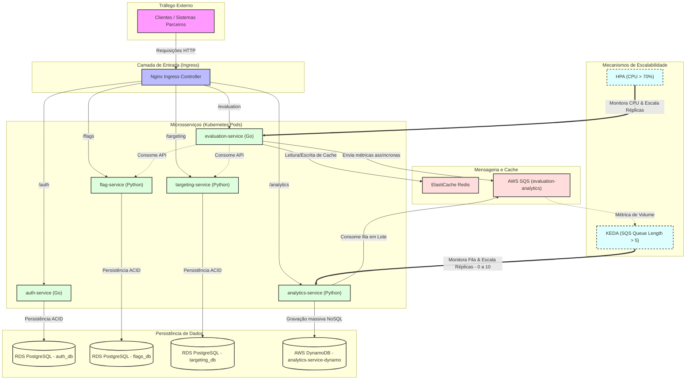

# Diagrama de Arquitetura — ToggleMaster

Este diagrama ilustra a topologia do **ToggleMaster**, detalhando o fluxo de tráfego dos clientes, o roteamento feito pelo Nginx Ingress Controller, as interações entre os microsserviços, suas respectivas camadas de dados (RDS, Redis, DynamoDB), a mensageria assíncrona (SQS) e os mecanismos específicos de escalabilidade (**HPA** e **KEDA**).

### Explicação do Fluxo:
1. **Roteamento de Borda**: O cliente faz requisições que chegam ao **Nginx Ingress Controller**. Com base no path (/auth, /flags, /evaluation, etc.), o tráfego é encaminhado ao microsserviço correspondente.
2. **Camada de Administração**:
   * O `auth-service` gerencia chaves de API salvando-as no PostgreSQL (`auth_db`).
   * O `flag-service` e o `targeting-service` controlam o CRUD de feature flags e regras de distribuição no PostgreSQL (`flags_db` e `targeting_db`).
3. **Fluxo de Avaliação Crítica**:
   * O `evaluation-service` realiza a validação das flags. Ele consulta e cacheia as configurações de avaliação no **Redis** (ElastiCache) para garantir tempos de resposta de sub-milissegundos.
   * Para não onerar a requisição do usuário final, a telemetria do evento avaliado é enviada de forma assíncrona ao **AWS SQS**.
4. **Camada de Auditoria e Escrita Massiva**:
   * O `analytics-service` atua como um worker assíncrono. Ele consome as mensagens em lote do SQS e as armazena no **Amazon DynamoDB** (banco NoSQL altamente escalável).
5. **Autoscaling**:
   * O **HPA** do Kubernetes monitora o uso de CPU do `evaluation-service` e escala o número de réplicas quando a média ultrapassa **70%**.
   * O **KEDA** monitora a profundidade de mensagens da fila do SQS e escala o `analytics-service` de **0 a 10 réplicas** dinamicamente. Se não houver mensagens acumuladas, ele reduz a quantidade de pods a zero.
